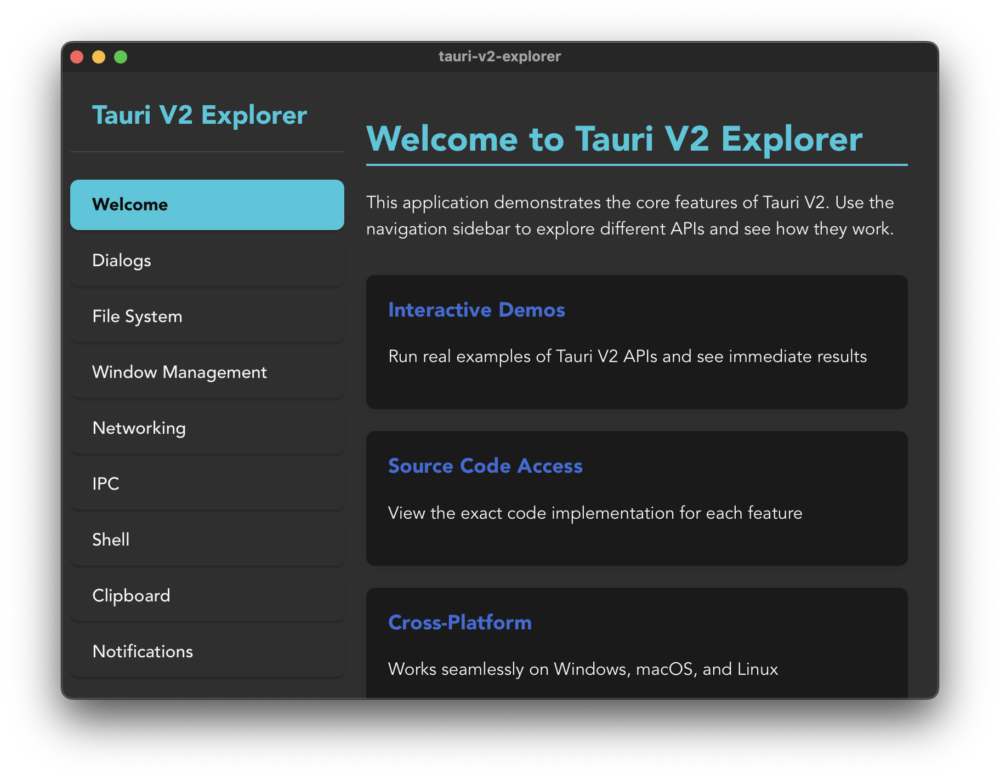

# Tauri V2 Explorer

[](https://github.com/AungMyoKyaw/Tauri-V2-Explorer/blob/main/LICENSE)
[](https://tauri.app)
[](https://reactjs.org)
[](https://tauri.app)

This application demonstrates the core features of Tauri V2 through interactive examples. Explore various Tauri APIs with hands-on examples and real-time feedback.



## Features Implemented

1. **Dialog APIs** - File open/save dialogs and message dialogs
2. **File System APIs** - Reading, writing, and managing files and directories
3. **Window Management APIs** - Controlling window properties and behavior
4. **Networking APIs** - Making HTTP requests
5. **IPC (Inter-Process Communication)** - Communication between frontend and backend
6. **Shell APIs** - Executing shell commands
7. **Clipboard APIs** - Reading from and writing to the system clipboard
8. **Notification APIs** - Sending desktop notifications

## Installation

1. Clone the repository
2. Install dependencies:
   ```bash
   npm install
   ```

Note: Ensure you have Rust and Cargo installed on your system. If not, install them from [https://www.rust-lang.org/](https://www.rust-lang.org/)

## Development

To run the application in development mode:

```bash
npm run tauri dev
```

This will start the Vite development server and launch the Tauri application.

## Building

To build the application for production:

```bash
npm run tauri build
```

This will create platform-specific bundles in the `src-tauri/target/release/bundle/` directory.

## Architecture

The application is structured as follows:

- `src/` - Frontend React components
  - `components/` - Reusable UI components (Sidebar, MainContent, CodeViewer, OutputDisplay)
  - `pages/` - Feature-specific pages for each Tauri API category (DialogPage, FsPage, WindowPage, etc.)
  - `App.tsx` - Main application component
- `src-tauri/` - Tauri backend code
  - `src/main.rs` - Application entry point
  - `src/lib.rs` - Tauri command handlers
  - `Cargo.toml` - Rust dependencies
  - `tauri.conf.json` - Tauri configuration
  - `capabilities/default.json` - Permission configuration

## Tauri Plugins Used

- `@tauri-apps/plugin-dialog` - For file dialogs
- `@tauri-apps/plugin-fs` - For file system operations
- `@tauri-apps/plugin-http` - For HTTP requests
- `@tauri-apps/plugin-shell` - For executing shell commands
- `@tauri-apps/plugin-clipboard-manager` - For clipboard operations
- `@tauri-apps/plugin-notification` - For desktop notifications
- `@tauri-apps/plugin-opener` - For opening files/URLs with default applications

## Usage

1. Launch the application
2. Use the sidebar to navigate between different API categories
3. Interact with the demo buttons to see the APIs in action
4. View the source code for each example to understand the implementation
5. See real-time output and feedback from API calls

## Permission Configuration

All permissions are configured in `src-tauri/capabilities/default.json`. This file includes permissions for all implemented features, including specific shell command permissions for security.

For more information on Tauri v2 ACL and Capabilities, see [Tauri v2 documentation](https://v2.tauri.app).

## License

MIT © [Aung Myo Kyaw](https://github.com/AungMyoKyaw)